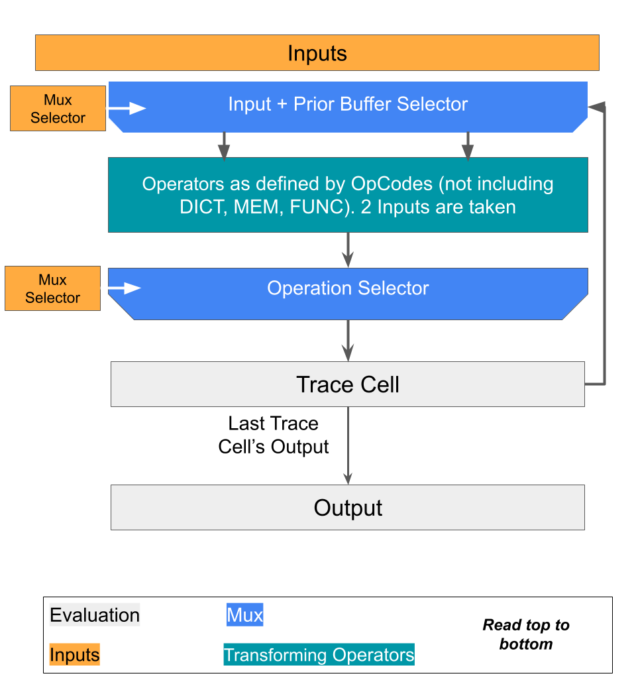

# Circom and Associated Tooling for Shoshin

## High Level

This folder contains the circuits, tests, and tooling for Shoshin. The `circuits` folder
contains Circom and tests and the `src` (will) contain tooling in Typescript. Tooling will be used to compile
Shoshin inputs into Circom friendly representations.

## `FD Emulator` Overview

We need our Circom to verify that an FD emulator ran correctly. We do this by specifying a "byte code" associated with each FD. Note that running an FD can be thought of as running some input on a program. Thus, we can have `inputs` and `program instructions`. Circuits can be programmed with [multiplexers](https://en.wikipedia.org/wiki/Multiplexer). We represent the `program instructions` as selection wires for multiplexers. Essentially, the selector inputs specify which inputs get fed into which operations and which operations are used, similar to a CPU!

### The specifics

Below we outline the inputs to the `FD Emulator` circuit.

```typescript
{
  /**
   * The value of the next state associated with each conditional and the default
   * The first NumberOfConditional values are associated with conditionals. The last one is a default
   */
  next_state: [Number of Conditionals + 1], // length of Number of Conditionals + 1
  /**
  * The input to the circuit
  */
  inputs: [Input Size].


  /**
   * Select how to `and` the conditionals. Essentially, every single clause conditional can be
   * transformed into a multi clause conditional by selecting which get `anded` together. The selection
   * index ranges from [0, Number of Conditional + 2) where setting
   * the selection to NumberOfConditionals is hardwired to `true` and NumberOfConditionals+1 is hardwired to `false`
   *
   * The and conditionals are the ones that are finally associated with the output `next_state`
   */
  and_selectors: [Number of Conditionals][Max Number of And Clauses],

	/**
   * Selects which conditional to use for each conditional:
   * [0, 0] (0) represent a == b
   * [1, 0] (1) represents a < b
   * [0, 1] (2) represents a <= b
   * [1, 1] (3) represents a != b
   */
  conditional_mux_sel: [Number of Conditionals][2],

  /**
   * for each conditional, a ?= b, select `a` and `b`. Selection values range
   * from Number of Conditionals + Number of Buffers, where i in [0, Number of Conditionals) selects the ith input
   * and i in [Number of Conditionals, Number of Conditionals + Number of Buffers)
   * selects the i - Number of Conditionals buffer.
   */
  conditional_inputs_mux_sel[Number of Conditionals][2],

  /**
   * Each buffer can operate on at most 3 elements. This selects the inputs for each buffer.
   * For buffer i in [0, Buffer Size), the selector takes Input Size + i possible values.
   * The first Input Size represent selecting from an input.
   * For j in [Input Size, Input Size + i),
   * j represents selecting the output of buffer `j - Input Size`
   */
  buffer_mux_sel: [Buffer Size][3],

  /**
  * Each buffer can take input, a, b, and c.
  *
  * The different types associated with the buffers are
  *
  * [0, 0] => a * b + c
  * [1, 0] => |a|
  * [0, 1] => a \ b (integer division)
  * [1, 1] => a % b
  */
  buffer_type_sel: [Buffer Size][2],

}
```

#### Circuit Block Diagram

The following block diagram also gives a high level overview of how the circuit works


### An example of a compiled FD

Say our mental space can be from the following enum,

```
enum MentalState {
  MS_IDLE=0,
  MS_ATTACK=1,
}
```

an our intents can be from

```
enum Intents {
  INT_NULL=0,
  INT_ATTACK=1,
}
```

and our transition functions are very basic.

For the next mental state we have,

```
if (stamina >= STAMINA_COST_ATTACK * 2 + 10) return MS_ATTACK;
else return MS_IDLE;
```

and our next intent we have

```
if (current_state == MS_ATTACK) return INT_ATTACK;
else return INT_NULL;
```

Now we step through what the Circom input would look like. First, note that we have a "wrapper" Circom module which instantiates the FD Emulator. This will be in a future PR. This wrapper module will ensure that global constants, such as `STAMINA_COST_ATTACK`, mental spaces, and public inputs are passed into the inputs of the FD Emulator properly.

Say that the maximum number of "anded clauses" is 2 and our buffer size is 1. So then, we would have the following FD Emulator Inputs for the next mental state

```typescript
{
  next_state: [MS_ATTACK, MS_IDLE],

  inputs: [curr_state, stamina, 2, 10, STAMINA_COST_ATTACK,],

  // We have 1 conditional, then the index following the number of conditionals (1) is true by default
  // I.e. we are choosing to do: `<conditional 0 output> && true`
  and_selectors: [[0, 1]],

  conditional_mux_sel: [[0, 1]], // Select a <= b

  conditional_inputs_mux_sel[[5, 1]], // Select <Buffer 1 out> <= stamina

  buffer_type_sel: [[0, 0]], // Quadratic constraint buffer is selected to give use a * b + c

  buffer_mux_sel: [[4, 2, 3]], // Buffer is now STAMINA_COST_ATTACK * 2 + 10
}
```

The next intent inputs are similar:

```typescript
{
  next_state: [INT_ATTACK, INT_NULL],

  inputs: [curr_state, stamina, MS_ATTACK, 0, STAMINA_COST_ATTACK,], // The 0 is just a dummy value

  // We have 1 conditional, then the index following the number of conditionals (1) is true by default
  // I.e. we are choosing to do: `<conditional 0 output> && true`
  and_selectors: [[0, 1]],

  conditional_mux_sel: [[0, 0]], // Select a == b

  conditional_inputs_mux_sel[[0, 2]], // Select curr_state == MS_ATTACK

  buffer_type_sel: [[0, 0]], // The buffer is unused so we just need some valid selection

  buffer_mux_sel: [[0, 0, 0]], // The buffer is unused so we just need some valid selection
}
```
